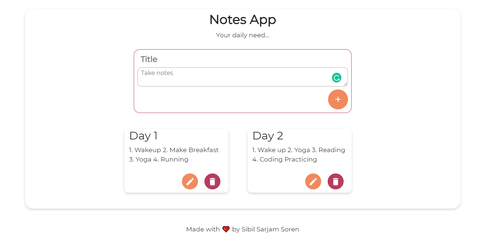
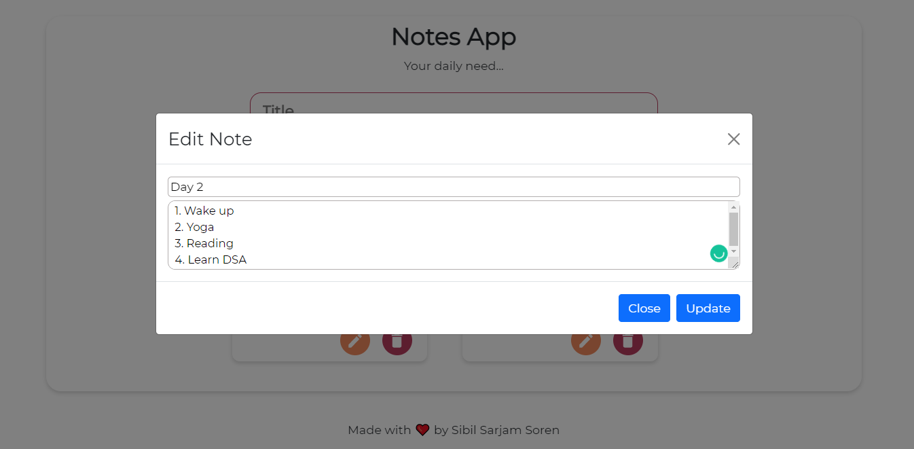
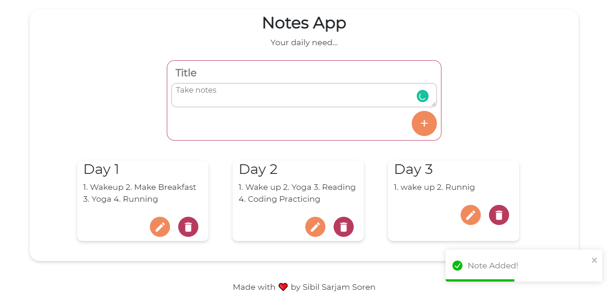

# Note Making App

The live link of the app: https://sibilsoren.github.io/note-app-react/

## About

This project is done for Decode 12.1 Full Stack Hackathon organized but **Board Infinity**. The task was to create a Note Taking App using HTML,CSS, React, React Hooks.

## Technology Stack Used

- React
- React Hooks
- Bootstrap
- HTML
- CSS
- Additional npm packages

## Features

- CRUD functionality
- Notification Alert
- Saves notes in local storage

## Screenshots

A star to this repo would be a great motivation for me :)
